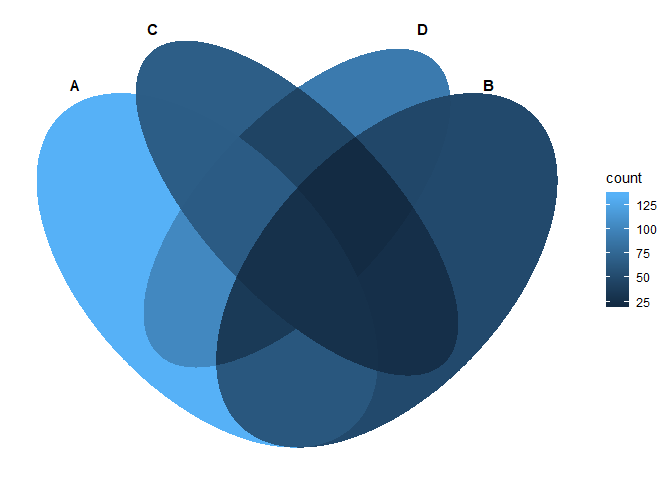
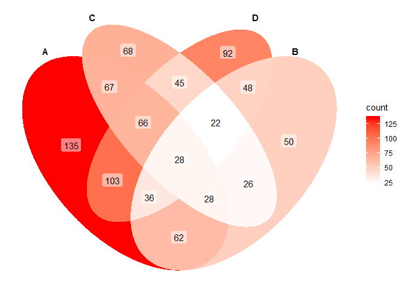

`ggVennDiagram` 尝试使用符合 ggplot 的语法绘制韦恩图。

目前仅支持 4 sets 韦恩图。参考下面的例子：

    library(ggVennDiagram)
    genes <- paste("gene",1:1000,sep="")
    set.seed(20190708)
    x <- list(A=sample(genes,300),B=sample(genes,525),C=sample(genes,440),D=sample(genes,350))
    ggVennDiagram(x)

`ggVennDiagram` 返回一个 `ggplot` 对象。这个对象是可以使用 `ggplot`
的语法修改的。

    library(ggplot2)
    ggVennDiagram(x) + scale_fill_gradient(low="white",high = "red")

`ggVennDiagram` 当前仅包含少数几个参数。

-   label: 设置是否显示数据标签。
-   n.sides: 相当于设置椭圆的分辨率，值越大，椭圆越平滑。

<!-- -->

    ggVennDiagram(x,label="count") + scale_fill_gradient(low="white",high = "red")

不过，椭圆的线型、颜色等也可以使用 `ggplot` 通用方法设定（作用于 polygon
图层）。

    ggVennDiagram(x,label="count",lty="dashed",color="grey") + scale_fill_gradient(low="white",high = "red")

