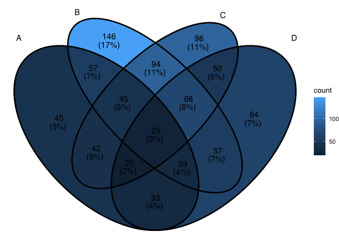
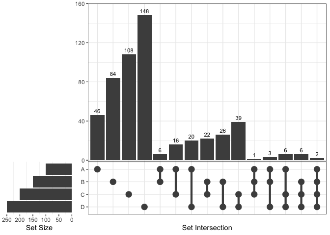
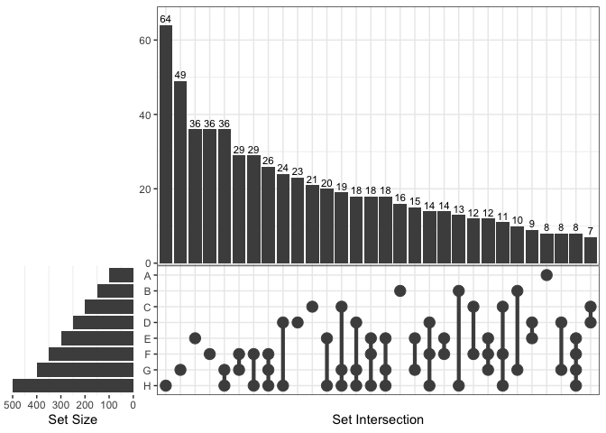

<!-- README.md is generated from README.Rmd. Please edit that file -->

# ggVennDiagram

<!-- badges: start -->

[](https://cran.r-project.org/package=ggVennDiagram)
[](https://cran.r-project.org/package=ggVennDiagram)
[](https://doi.org/10.3389/fgene.2021.706907)
[](https://cran.r-project.org/package=ggVennDiagram)
[](https://github.com/gaospecial/ggVennDiagram)
[](https://app.codecov.io/gh/gaospecial/ggVennDiagram)
<!-- badges: end -->

‘`ggVennDiagram`’ enables fancy Venn plot with 2-7 sets and generates
publication quality figure. It also support upset plot with unlimited
number of sets from version 1.4.4.

## Installation

You can install the released version of ggVennDiagram from
[CRAN](https://CRAN.R-project.org) with:

``` r
install.packages("ggVennDiagram")
```

And the development version from [GitHub](https://github.com/) with:

``` r
# install.packages("devtools")
devtools::install_github("gaospecial/ggVennDiagram")
```

## Citation

If you find **ggVennDiagram** is useful and used it in academic papers,
you may cite this package as:

1.  Gao, C.-H., Chen, C., Akyol, T., Dușa, A., Yu, G., Cao, B., and
    Cai, P. (2024). ggVennDiagram: intuitive Venn diagram software
    extended. [iMeta](https://onlinelibrary.wiley.com/journal/2770596x)
    3, 69. doi:
    [10.1002/imt2.177](https://onlinelibrary.wiley.com/doi/full/10.1002/imt2.177).
2.  Gao, C.-H., Yu, G., and Cai, P. (2021). ggVennDiagram: An Intuitive,
    Easy-to-Use, and Highly Customizable R Package to Generate Venn
    Diagram. Frontiers in Genetics 12, 1598. doi:
    [10.3389/fgene.2021.706907](https://www.frontiersin.org/articles/10.3389/fgene.2021.706907/full).

## Example

`ggVennDiagram` maps the fill color of each region to quantity, allowing
us to visually observe the differences between different parts.

``` r
library(ggVennDiagram)
genes <- paste("gene",1:1000,sep="")
set.seed(20231214)
x <- list(A=sample(genes,300),
          B=sample(genes,525),
          C=sample(genes,440),
          D=sample(genes,350))
```

`ggVennDiagram` return a `ggplot` object, the fill/edge colors can be
further modified with `ggplot` functions.

``` r
library(ggplot2)
ggVennDiagram(x) + scale_fill_gradient(low="grey90",high = "red")
```


``` r

ggVennDiagram(x, set_color = c("blue","red","green","purple"))
```


`ggVennDiagram` support 2-7 dimension Venn plot. The generated figure is
generally ready for publish. The main function `ggVennDiagram()` will
check how many items in the first parameter and call corresponding
function automatically.

The parameter `category.names` is set names. And the parameter `label`
can label how many items are included in each parts.

``` r
ggVennDiagram(x,category.names = c("Stage 1","Stage 2","Stage 3", "Stage4"))
```


``` r

ggVennDiagram(x,category.names = c("Stage 1","Stage 2","Stage 3", "Stage4"), label = "none")
```


Set `label_alpha = 0` to remove label background.

``` r
ggVennDiagram(x, label_alpha=0)
```



## Showing intersection values

*Note: you need to install the GitHub version to enable these
functions.*

We implemented the `process_region_data()` to get intersection values.

``` r
y <- list(
  A = sample(letters, 8),
  B = sample(letters, 8),
  C = sample(letters, 8),
  D = sample(letters, 8)
)

process_region_data(Venn(y))
#> # A tibble: 15 × 4
#>    id      name    item      count
#>    <chr>   <chr>   <list>    <int>
#>  1 1       A       <chr [3]>     3
#>  2 2       B       <chr [1]>     1
#>  3 3       C       <chr [3]>     3
#>  4 4       D       <chr [0]>     0
#>  5 1/2     A/B     <chr [0]>     0
#>  6 1/3     A/C     <chr [1]>     1
#>  7 1/4     A/D     <chr [2]>     2
#>  8 2/3     B/C     <chr [1]>     1
#>  9 2/4     B/D     <chr [3]>     3
#> 10 3/4     C/D     <chr [1]>     1
#> 11 1/2/3   A/B/C   <chr [1]>     1
#> 12 1/2/4   A/B/D   <chr [1]>     1
#> 13 1/3/4   A/C/D   <chr [0]>     0
#> 14 2/3/4   B/C/D   <chr [1]>     1
#> 15 1/2/3/4 A/B/C/D <chr [0]>     0
```

If only several items were included, intersections may also be viewed
interactively by `plotly` method (if you have two many items, this is
useless).

``` r
ggVennDiagram(y, show_intersect = TRUE)
```

In web browser or RStudio, you will get:


# Customizing your plot

There are three components in a Venn plot: 1) the set labels; 2) the
edge of sets; and 3) the filling regions and labels (optional) of each
parts. We separately stored these data in a structured `VennPlotData`
object, in which labels, edges and regions are stored as data frames.

In general, `ggVennDiagram()` plot a Venn in three steps:

- get the coordinates of a applicable shape from internal `shapes`
  datasets.
- calculate sub regions of sets, including both the shape regions and
  sets members, and return a `VennPlotData` object that includes all
  necessary definitions. We implement a number of set operations
  functions to do this job.
- plot using `ggplot2` functions.

Please check `vignette("fully-customed", package = "ggVennDiagram")` for
more information.

# Venn Diagram for more than four sets

If you have reviewed my codes, you may find it is easy to support Venn
Diagram for more than four sets, as soon as you find a ideal parameter
to generate more circles or ellipses in the plot. The key point is to
let the generated ellipses have exactly one intersection for each
combination.

## Venn Diagram of up to seven sets

From v1.0, `ggVennDiagram` can plot up to seven dimension Venn plot.
Please note that the shapes for this five sets diagram, as well as those
for six and seven sets, are imported from the original package
[`venn`](https://CRAN.R-project.org/package=venn) authored by Adrian
Dușa.

However, Venn Diagram for more than four sets may be meaningless in some
conditions, as some parts may be omitted in such ellipses. Therefore, it
is only useful in specific conditions. For example, if the set
intersection of all group are extremely large, you may use several
ellipses to draw a “flower” to show that.

``` r
x <- list(A=sample(genes,300),
          B=sample(genes,525),
          C=sample(genes,440),
          D=sample(genes,350),
          E=sample(genes,200),
          F=sample(genes,150),
          G=sample(genes,100))

# two dimension Venn plot
ggVennDiagram(x[1:2],label = "none")

# three dimension Venn plot
ggVennDiagram(x[1:3],label = "none")

# four dimension Venn plot
ggVennDiagram(x[1:4],label = "none")

# five dimension Venn plot
ggVennDiagram(x[1:5],label = "none")

# six dimension Venn plot
ggVennDiagram(x[1:6],label = "none")

# seven dimension Venn plot
ggVennDiagram(x,label = "none")
```


## Native support of upset plot

From version 1.4.4, `ggVennDiagram` supports unlimited number of sets,
as it can draw a plain upset plot automatically when number of sets is
more than 7.

``` r
# add an extra member in list
x$H = sample(genes,500)
ggVennDiagram(x)
#> Warning in ggVennDiagram(x): Only support 2-7 dimension Venn diagram. Will give
#> a plain upset plot instead.
#> Warning: Removed 1 rows containing missing values (`position_stack()`).
```


Upset plot can also be used by setting `force_upset = TRUE`.

``` r
ggVennDiagram(x[1:4], force_upset = TRUE, order.set.by = "name", order.intersect.by = "none")
```



Since upset plot is consisted with upper panel and lower panel, and left
panel and right panel, the appearance should be adjusted with different
conditions. We provide two parameters, which are `relative_height` and
`relative_width` to do this.

For example, if we want to give more space to lower panel, just change
the `relative_height` from 3 (the default) to 2.

``` r
venn = Venn(x)
plot_upset(venn, nintersects = 30, relative_height = 2, relative_width = 0.3)
```



# Reference

Adrian Dușa (2024) *venn: Draw Venn Diagrams*, R package version 1.12.
<https://CRAN.R-project.org/package=venn>.
