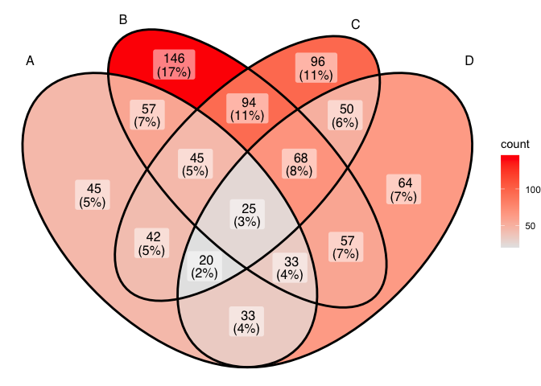

<!-- README.md is generated from README.Rmd. Please edit that file -->

# ggVennDiagram

<!-- badges: start -->

<!-- badges: end -->

‘`ggVennDiagram`’ enables fancy Venn plot with 2-4 sets and generates
publication quality figure. It is the first software that can
automatically fill different colors to each part of a Venn diagram.

## Installation

You can install the released version of ggVennDiagram from
[CRAN](https://CRAN.R-project.org) with (under evaluation in CRAN):

``` r
install.packages("ggVennDiagram")
```

And the development version from [GitHub](https://github.com/) with:

``` r
# install.packages("devtools")
devtools::install_github("gaospecial/ggVennDiagram")
```

## Example

`ggVennDiagram` maps the fill color of each region to quantity, allowing
us to visually observe the differences between different parts.

``` r
library(ggVennDiagram)
genes <- paste("gene",1:1000,sep="")
set.seed(20190708)
x <- list(A=sample(genes,300),B=sample(genes,525),C=sample(genes,440),D=sample(genes,350))

# four dimension Venn plot
ggVennDiagram(x)
```


``` r

# three dimension Venn plot
ggVennDiagram(x[1:3])
```


``` r

# two dimension Venn plot
ggVennDiagram(x[1:2])
```


`ggVennDiagram` return a ggplot object, which can be further modified
with `ggplot` functions.

``` r
library(ggplot2)
ggVennDiagram(x) + scale_fill_gradient(low="blue",high = "red")
#> Scale for 'fill' is already present. Adding another scale for 'fill',
#> which will replace the existing scale.
```


``` r

ggVennDiagram(x,lty="dashed",color="black",size=2) + scale_fill_gradient(low="white",high = "red")
#> Scale for 'fill' is already present. Adding another scale for 'fill',
#> which will replace the existing scale.
```


`ggVennDiagram` now support 2-4 dimension Venn plot. The generated
figure is generally ready for publish. The main function
`ggVennDiagram()` will check how many items in the first paramenter and
call corresponding function automatically.

The parameter `category.names` reprents set names. And the parameter
`label` can label how many items are included in each parts.

``` r
ggVennDiagram(x,category.names = c("Stage 1","Stage 2","Stage 3", "Stage4"))
```


``` r

ggVennDiagram(x,category.names = c("Stage 1","Stage 2","Stage 3", "Stage4"), label = NULL)
```


Set `label_alpha = 0` to remove label background

``` r
ggVennDiagram(x, label_alpha=0)
```



# Venn Diagram for more than four sets

If you have reviewed my codes, you may find it is easy to support Venn
Diagram for more than four sets, as soon as you find a ideal parameter
to generate more circles or ellipses in the plot. The key point is to
let the generated ellipses have exactly one intersection for each
combination.

However, Venn Diagram for more than four sets may be meaningless in
some conditions, as some parts may be omittd in such ellipses.
Therefore, it is only useful in specific conditions. For example, if the
set intersection of all group are extremely large, you may use several
ellipses to draw a “flower” to show that.

# “`ggVennDiagram`” 诞生记

在 *@GuangchuangYu* 的公众号下面，我投稿了一篇文章，介绍了 “`ggVennDiagram`”
包开发的始末，有兴趣的同学可以移步[至此](http://mp.weixin.qq.com/s?__biz=MzI5NjUyNzkxMg==&mid=2247488094&idx=1&sn=a25732ba379f5954780c5b9caaf32a12&chksm=ec43a319db342a0ffc3fee7d9f34d9aee68dc554349fadebdfeddd47fcc569660d3d2985d6aa&mpshare=1&scene=23&srcid=&sharer_sharetime=1571301081933&sharer_shareid=04af35358b62caecb0d9de05d6f60e54#rd)查看。
