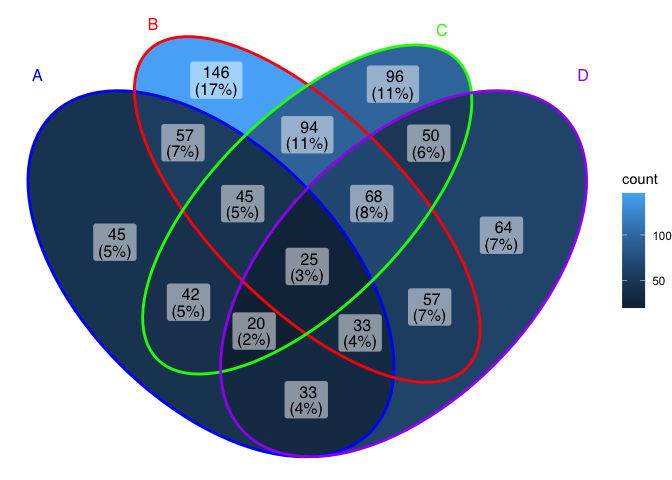

<!-- README.md is generated from README.Rmd. Please edit that file -->

# ggVennDiagram

<!-- badges: start -->

[](https://cran.r-project.org/package=ggVennDiagram)
[](https://cran.r-project.org/package=ggVennDiagram)
[](https://cran.r-project.org/package=ggVennDiagram)
[](https://cran.r-project.org/package=ggVennDiagram)
[](https://github.com/gaospecial/ggVennDiagram)
[](https://codecov.io/gh/gaospecial/ggVennDiagram)
<!-- badges: end -->

‘`ggVennDiagram`’ enables fancy Venn plot with 2-7 sets and generates
publication quality figure.

## Installation

You can install the released version of ggVennDiagram from
[CRAN](https://CRAN.R-project.org) with (under evaluation in CRAN):

``` r
install.packages("ggVennDiagram")
```

And the development version from [GitHub](https://github.com/) with:

``` r
# install.packages("devtools")
devtools::install_github("gaospecial/ggVennDiagram")
```

## Citation

If you find **ggVennDiagram** is useful and used it in academic papers,
you may cite this package as:

Gao, C.-H., Yu, G., and Cai, P. (2021). ggVennDiagram: An Intuitive,
Easy-to-Use, and Highly Customizable R Package to Generate Venn Diagram.
Frontiers in Genetics 12, 1598. doi:
[10.3389/fgene.2021.706907](https://www.frontiersin.org/articles/10.3389/fgene.2021.706907/full).

## Example

`ggVennDiagram` maps the fill color of each region to quantity, allowing
us to visually observe the differences between different parts.

``` r
library(ggVennDiagram)
genes <- paste("gene",1:1000,sep="")
set.seed(20231214)
x <- list(A=sample(genes,300),
          B=sample(genes,525),
          C=sample(genes,440),
          D=sample(genes,350))
```

`ggVennDiagram` return a `ggplot` object, the fill/edge colors can be
further modified with `ggplot` functions.

``` r
library(ggplot2)
ggVennDiagram(x) + scale_fill_gradient(low="blue",high = "red")
```


``` r

ggVennDiagram(x) + scale_color_brewer(palette = "Paired")
```


`ggVennDiagram` now support 2-7 dimension Venn plot. The generated
figure is generally ready for publish. The main function
`ggVennDiagram()` will check how many items in the first parameter and
call corresponding function automatically.

The parameter `category.names` is set names. And the parameter `label`
can label how many items are included in each parts.

``` r
ggVennDiagram(x,category.names = c("Stage 1","Stage 2","Stage 3", "Stage4"))
```


``` r

ggVennDiagram(x,category.names = c("Stage 1","Stage 2","Stage 3", "Stage4"), label = "none")
```



Set `label_alpha = 0` to remove label background

``` r
ggVennDiagram(x, label_alpha=0)
```


## Showing intersection values

*Note: you need to install the GitHub version to enable these
functions.*

We implemented the `process_region_data()` to get intersection values.

``` r
y <- list(
  A = sample(letters, 8),
  B = sample(letters, 8),
  C = sample(letters, 8),
  D = sample(letters, 8)
)

process_region_data(Venn(y))
#> # A tibble: 15 × 4
#>    id      item      count name   
#>    <chr>   <list>    <int> <chr>  
#>  1 1       <chr [3]>     3 A      
#>  2 2       <chr [1]>     1 B      
#>  3 3       <chr [3]>     3 C      
#>  4 4       <chr [0]>     0 D      
#>  5 1/2     <chr [0]>     0 A/B    
#>  6 1/3     <chr [1]>     1 A/C    
#>  7 1/4     <chr [2]>     2 A/D    
#>  8 2/3     <chr [1]>     1 B/C    
#>  9 2/4     <chr [3]>     3 B/D    
#> 10 3/4     <chr [1]>     1 C/D    
#> 11 1/2/3   <chr [1]>     1 A/B/C  
#> 12 1/2/4   <chr [1]>     1 A/B/D  
#> 13 1/3/4   <chr [0]>     0 A/C/D  
#> 14 2/3/4   <chr [1]>     1 B/C/D  
#> 15 1/2/3/4 <chr [0]>     0 A/B/C/D
```

If only several items were included, intersections may also be viewed
interactively by `plotly` method (if you have two many items, this is
useless).

``` r
ggVennDiagram(y, show_intersect = TRUE)
```

In web browser or RStudio, you will get:


# Customizing your plot

There are three components in a Venn plot: 1) the set labels; 2) the
edge of sets; and 3) the filling regions of each parts. We separately
stored these data in a structured S4 class `VennPlotData` object, in
which labels, edges and regions are stored as simple features.

Simple features or simple feature access refers to a formal standard
(ISO 19125-1:2004) that describes how objects in the real world can be
represented in computers, with emphasis on the spatial geometry of these
objects. But here we employed this to describe the coordinates of Venn
components.

In general, `ggVennDiagram()` plot a Venn in three steps:

- get the coordinates of a applicable shape from internal `shapes`
  datasets.
- calculate sub regions of sets, including both the shape regions and
  sets members, and return a `PlotDataVenn` object that includes all
  necessary definitions. We implement a number of set operations
  functions to do this job.
- plot using `ggplot2` functions.

Please check `vignette()` for more information.

# Venn Diagram for more than four sets

If you have reviewed my codes, you may find it is easy to support Venn
Diagram for more than four sets, as soon as you find a ideal parameter
to generate more circles or ellipses in the plot. The key point is to
let the generated ellipses have exactly one intersection for each
combination.

From v1.0, `ggVennDiagram` can plot up to seven dimension Venn plot. We
would like to acknowledgment the author of package `venn`, for his kind
help on sharing the required shape coordinates for this feature.

However, Venn Diagram for more than four sets may be meaningless in some
conditions, as some parts may be omitted in such ellipses. Therefore, it
is only useful in specific conditions. For example, if the set
intersection of all group are extremely large, you may use several
ellipses to draw a “flower” to show that.

``` r
x <- list(A=sample(genes,300),
          B=sample(genes,525),
          C=sample(genes,440),
          D=sample(genes,350),
          E=sample(genes,200),
          F=sample(genes,150),
          G=sample(genes,100))

# seven dimension Venn plot
ggVennDiagram(x)

# six dimension Venn plot
ggVennDiagram(x[1:6])

# five dimension Venn plot
ggVennDiagram(x[1:5])

# four dimension Venn plot
ggVennDiagram(x[1:4])

# three dimension Venn plot
ggVennDiagram(x[1:3])

# two dimension Venn plot
ggVennDiagram(x[1:2])
```


# Futher information

## Venn Diagram cookbook in R

I have released a online book to introduce the development of
`ggVennDiagram`, it contains a chapter that compare many different R
packages in plotting a Venn. Refer to [Venn Diagram cookbook in
R](https://venn.bio-spring.top).

## 公众号文章

在 *@GuangchuangYu* 的公众号下面，我投稿了两篇文章，介绍了
“`ggVennDiagram`” 包开发的始末。

- [“`ggVennDiagram`”
  诞生记](https://mp.weixin.qq.com/s/peNWKC5m7EWEv6w3m4rsIA)
- [“`ggVennDiagram`”
  的重构](https://mp.weixin.qq.com/s/6kDXPrJRyXab6HpVjq6JBw)
